# Starbucks-Customer-Segmentation
Customer segmentation for Starbucks reward program members on the basis of their reactions to offers, to further assist marketing team design marketing strategies accordingly 

I watched the netflix documentary __"The Social Dilemma"__ and got fascinated by how marketing strategies use Data Science in our era of Big Data.

I also read an article on how __Starbucks is like a bank__ on Groww ( yeah, me proud reader of Groww and Finshots), and found it intresting how starbucks earns lot of money through intrest earned on the money deposited. Being a curious person, I decided to investigate how starbucks convinced its customers to deposit so much money with them. That's how I discovered Starbuck's reward program. 

So, being a coffee lover and someone intrested in business mechanisms, I decided to take up this project. (My favourite is Caramel Latte, Thanks :) 

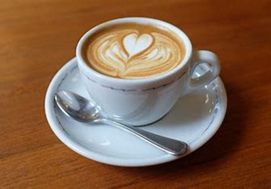
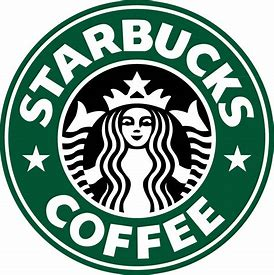

* __ML Techniques used__ : K-Means, PCA, t-SNE, Gaussian Mixture Models, Silhouette plot, SSE/Inertia, Cluster Analysis
* __Project Domains__ : Market Segmentation, Marketing, Data Science, Cluster Analysis

__Q Why segment customers ???__

Ans - Well, because it is still a very difficult and computationally intensive task to target each customer in unique ways, as well as there would be lots of customers on which similar Marketing strategies and Discount offers would work well. Hence it makes intutive sense to break the customer base into clusters on the basis of how and which offers they react to and then proceed to make targeted strategies. 

## If I had a minute to tell u about this project - 

* Coffee, Business, Marketing, Data Science , Action !
* Performed __Data Engineering__ to merge the 3 datasets, performed __Data Cleaning__ (Some enteries were errors cause their data was missing as well as age was 118 which seemed to be an error).
  (coe == customer offer engagement) 
  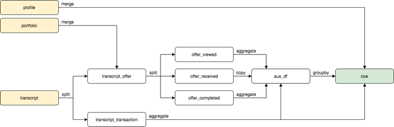
* Used __Power Transforms__ to make dataset more gaussian since __K-means__ likes rounder (isotropic) clusters. 
* Performed __PCA ( Principal Component Analysis )__ to __reduce Data Dimensionality__ and avoid __Curse of Dimensionality__ , and also so that redundant features would be removed and the data would be in continuous so that we don't need to bother ourselves with __K-Prototype__ kind of algorithms ( its K-means plus K-mode for mixed (continuous plus categorical) data modelling )

  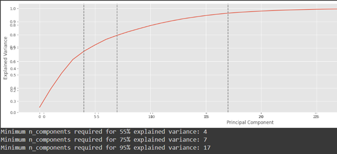
*  Used __K-means clustering__ to form clusters, along with __Silhouette score__ and __SSE(Sum of Squared Errors)/Inertia__ to determine optimal number of clusters, and then __Silhouette Plots__ to further analyse quality of clusters.

  
  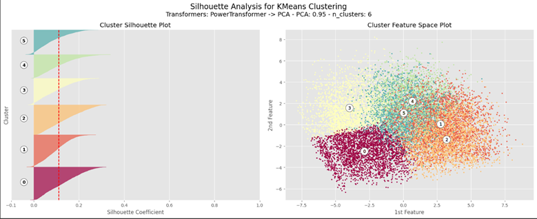

* Visualized Clusters in 2-D using __t-SNE__ to further confirm the feasiblity of clusters.
* Performed __Gaussian Mixture Modelling__ since it is a __Generative__ and __not Discriminative classifier__, also it's a __soft classifier__, to allow further scope for data-points on borders of clusters or customers which behave like 2 or more clusters. Also it can form "non-round" clusters better too.

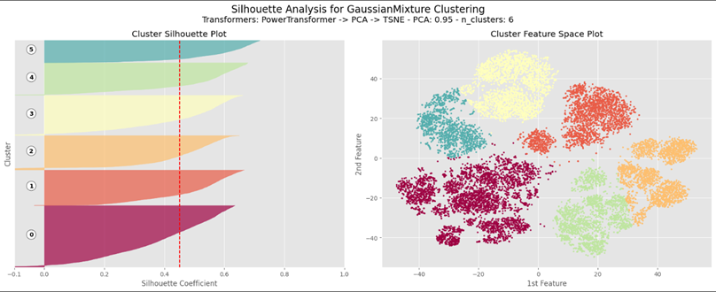
* Performed __Cluster Analysis__ to determine properties and behaviours of clusters, understood the physical significance of the clusters in real life, and went ahead to think of how the company should make different strategies for these clusters.

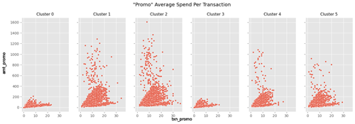
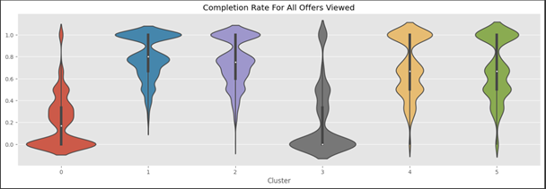

* Studied present Starbucks site to see their presently deployed marketing strategies for a new customer. Developed __Product Understanding__ and understanding of __UI/UX for marketing__ used by them.

## My findings 

* (Hereby might refer to clusters as "segments" too sometimes)
* One cluster resembled people who were probably __young office going people__ who were our __regular customers__, this is the customer segment which provides us the __most monetary value__ currently. They react well to all offers, since they are regulars they already know the ins-and-outs of our schemes and hence __use offers regularly__. In my opinion, we can leave them as it is going, or even __reduce__ the number of __offers__ given to them __slightly__ as long as they don't seem to be running away from us. 
* Another cluster had a lot of Rich, older members of reward program who usually __react to discounts__ but __not to BOGO's__ (Buy One Get One). A clear indication is that they like to __drink coffee alone__, and we can give them more discount offers than anything which requires them to buy more than one food item, and specifically not give them a BOGO offer.
* Another customer segment was behaving in such a way that they __only come__ to Starbucks __when__ there is an __offer__ (Us bhai us) , and their non-offer period spending is very low. I feel that by giving them __small but regular offers__ on weekends, we can __convert__ them to __regular__ customers.
* Another cluster resembled __lower-income groups__ which did __not__ seemed to be __tempted__ by any type of offers. Either starbucks can introduce __lower cost drinks__ to target these, or it can __maintain its brand image and ignore__ these customers. Since India is a __price sensitive market__, to thrive in such a market it wouldn't hurt much to introduce a few __"Mid-Priced" meals targetting middle class__ customers, and then slowly introducing __combo-meals__ where we can sell a mid-priced and high priced item together in the name of discount.
* One cluster had people who are __moderate__ customers, with an okayish amount of spend, and I feel it is best to leave them as it is, and give them __offers only when their frequency__ seems to have __decreased__.
* The last cluster had no appreciable features, some of them were __"ghosts"__ who had come only once or twice, and had very irregular patterns. Which , is a gentle remainder that all things which make __sense mathematically__ do __not__ have to make __business sense__ .

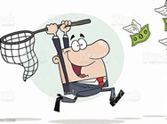

## The Starbucks Website Analysis

* The website was designed in such a way to pull all the customers to its Rewards program , which makes intutive sense since Starbucks is earning free money from the intrest .
  
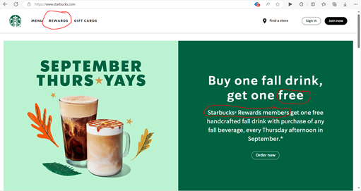

* The prices weren't revealed until the billing time, since the feeling of "loosing" money would drive away customers.

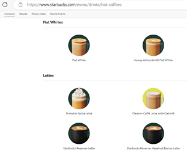

* Simple, and clear cut message to anyone who opens the rewards tab. Luring them to join rewards program. Marketing in its true sense.

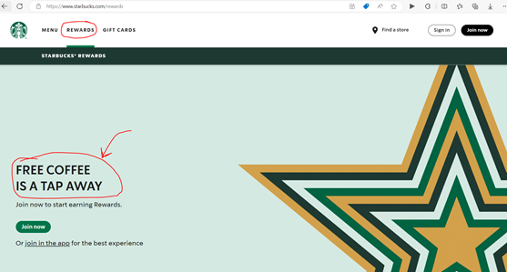

